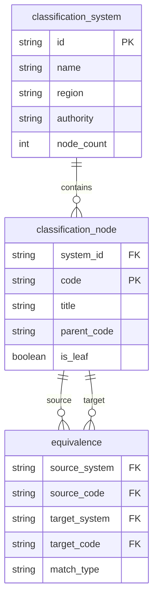
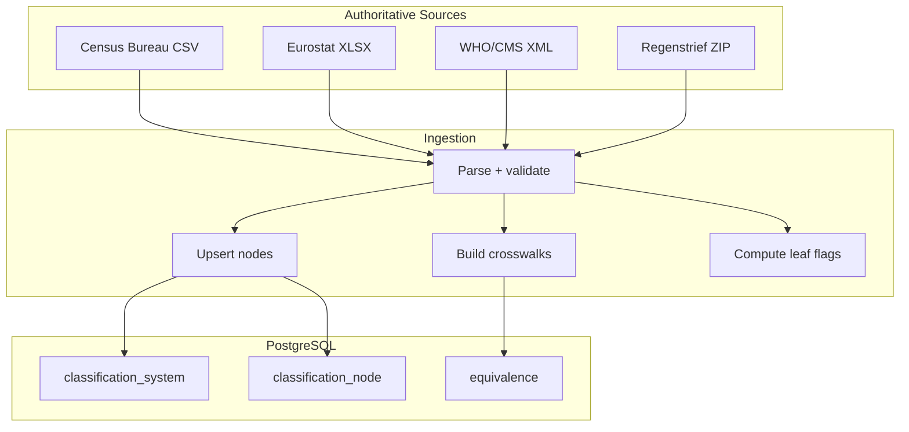
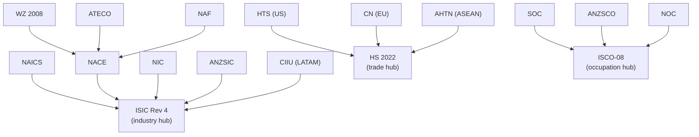

## 1,000 Systems, 1.2M+ Nodes, 321K Crosswalk Edges

> **TL;DR:** Three tables, one ingestion pipeline, three ingester patterns, and a hub-and-spoke crosswalk topology. This is how we built a knowledge graph connecting every major classification system in the world.

---

## The data model

The entire graph fits in three tables:

| Table | Rows | What it stores |
|-------|------|---------------|
| `classification_system` | 1,000+ | System metadata (name, region, authority) |
| `classification_node` | 1,212,000+ | Every code in every system (hierarchy via parent_code) |
| `equivalence` | 321,000+ | Crosswalk edges between systems |

The simplicity is intentional. Classification systems are trees (codes have parents). Crosswalks are edges (this code maps to that code). Three tables capture everything.

## The ingestion pipeline

Each system has a dedicated ingester. Every ingester downloads directly from the authoritative source - Census Bureau, UN, WHO, Eurostat - and loads into PostgreSQL.

## Three ingester patterns

### Pattern A: Standalone (~15 systems)

Custom parser for a specific source file. Handles CSV, XLSX, XML, JSON, or HTML.

> Examples: NAICS (Census CSV), LOINC (Regenstrief ZIP), ICD-10-CM (CMS XML), HS (WCO structure)

### Pattern B: NACE-derived (~30 systems)

European national systems that copy NACE Rev 2 exactly. The ingester copies all 996 NACE nodes and creates 1:1 equivalence edges. About 15 lines of code.

> Examples: WZ 2008 (Germany), ATECO 2007 (Italy), NAF Rev 2 (France), PKD 2007 (Poland)

### Pattern C: ISIC-derived (~80 systems)

National adaptations of ISIC Rev 4. Same copy-and-link pattern. Covers most of Latin America, Africa, Asia, and the Middle East.

> Examples: CIIU (Colombia, Chile, Peru), VSIC (Vietnam), BSIC (Bangladesh)

## Scale challenges

| System | Codes | Challenge |
|--------|-------|-----------|
| NCI Thesaurus | 211,072 | Largest system - pushed full-text search indexing limits |
| NDC (Drug Codes) | 112,077 | Product-level granularity, frequent updates |
| LOINC | 102,751 | ZIP streaming, batch insert for memory management |
| ICD-10-CM | 97,606 | 7-level deep hierarchy, complex parent chain logic |
| ICD-10-PCS | 79,987 | Procedure codes with combinatorial structure |
| Patent CPC | 254,249 | Widest system - custom XML parser required |

## Crosswalk topology

The 321,000 edges follow a hub-and-spoke pattern:

**Three hubs:**
- **ISIC Rev 4** for industry (most national systems have a direct crosswalk)
- **HS 2022** for trade (national tariff schedules extend HS)
- **ISCO-08** for occupations (national systems have concordances)

Translation between any two systems typically routes through a hub: Source -> Hub -> Target.

## Provenance

Every system has a provenance tier so consumers can decide how much to trust each mapping:

| Tier | Meaning | Example |
|------|---------|---------|
| `official_source` | Parsed directly from the authority | NAICS from Census Bureau |
| `official_derived` | National adaptation of a reference | WZ 2008 from NACE Rev 2 |
| `expert_curated` | Built from authoritative references | Domain taxonomies |
| `ai_assisted` | Structure verified by automated tools | Some domain expansions |

## Key design decisions

- **Leaf flags computed dynamically** - never hard-coded, always derived from the hierarchy
- **Idempotent ingestion** - every ingester uses `ON CONFLICT ... DO UPDATE`, safe to re-run
- **TDD enforced** - every ingester has a test file, tests run in an isolated `test_wot` schema
- **No ORMs** - raw SQL via asyncpg for performance at 1.2M rows
