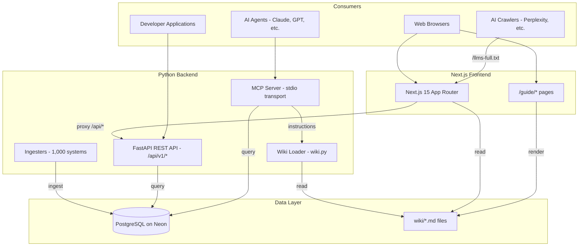
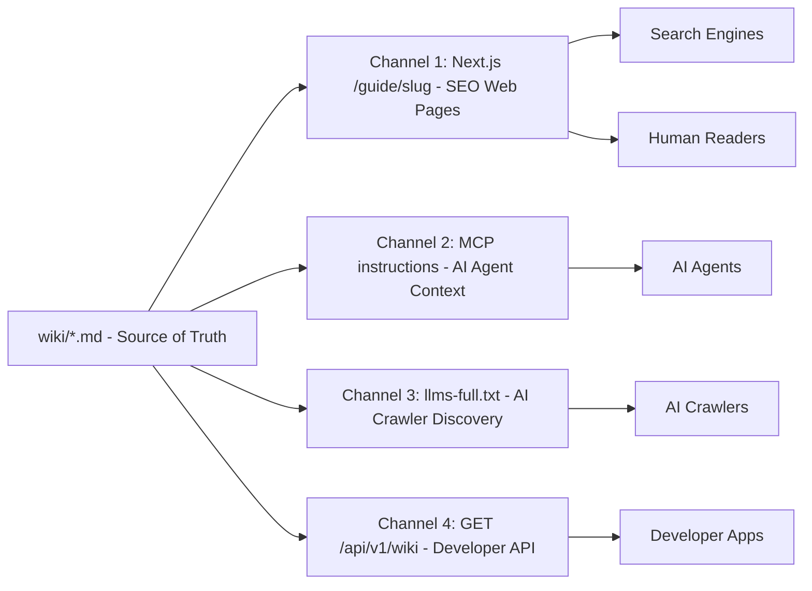
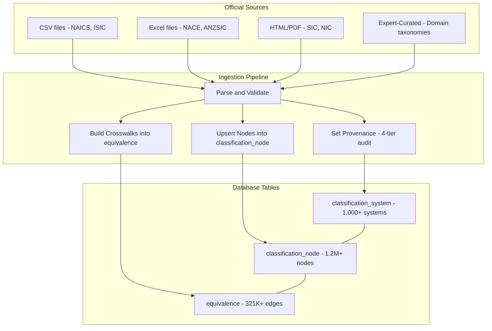
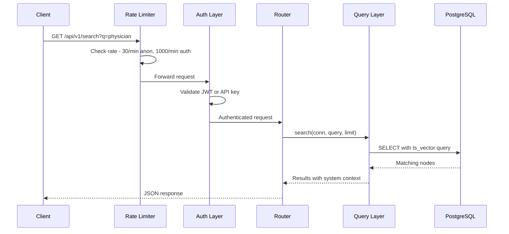
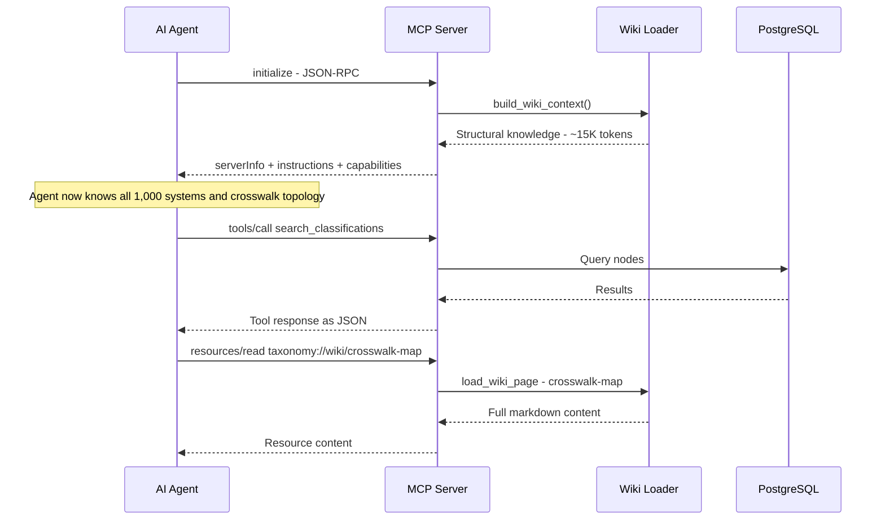

## System Architecture and Data Flows

This guide provides visual documentation of the WorldOfTaxonomy system architecture, data ingestion pipeline, API request handling, MCP session lifecycle, and the four-channel wiki distribution system.

## System Architecture Overview

The platform serves three consumer interfaces - a web application, a REST API, and an MCP server - all backed by a shared PostgreSQL database and wiki knowledge layer.

## Four-Channel Wiki Data Flow

The wiki system follows the "write once, serve four ways" pattern. A single set of curated markdown files feeds all distribution channels.

### Channel Details

| Channel | Format | Cache/Refresh | Audience |
|---------|--------|---------------|----------|
| Web pages at /guide/ | Server-rendered HTML with SEO metadata | Static generation at build time | Human readers, search engines |
| MCP instructions | Plain text injected at session start | Loaded on MCP initialize | AI agents (Claude, GPT, Gemini) |
| llms-full.txt | Concatenated plain text | Regenerated on build | AI crawlers (Perplexity, Google AI) |
| Wiki API | JSON with raw markdown | On-demand from disk | Developer applications, RAG pipelines |

## Classification Data Ingestion Pipeline

Raw data from official sources flows through the ingestion pipeline into three database tables.

### Ingestion Steps

1. **Parse**: Read the source file (CSV, Excel, HTML, or hardcoded data). Validate code format, hierarchy, and completeness.
2. **Upsert nodes**: Insert or update rows in `classification_node` with code, title, description, level, parent_code, is_leaf, and seq_order.
3. **Build crosswalks**: Create bidirectional edges in the `equivalence` table with match_type (exact, partial, broader, narrower, related).
4. **Set provenance**: Update `classification_system` with data_provenance tier, source_url, source_date, license, and source_file_hash.

## API Request Flow

Every API request passes through rate limiting and authentication before reaching the query layer.

### Rate Limit Tiers

| Tier | Requests/Minute | Daily Limit |
|------|-----------------|-------------|
| Anonymous | 30 | Unlimited |
| Free | 1,000 | Unlimited |
| Pro | 5,000 | 100,000 |
| Enterprise | 50,000 | Unlimited |

## MCP Session Lifecycle

When an AI agent connects to the MCP server, it receives structural knowledge about the entire knowledge graph before making any tool calls.

### MCP Capabilities

The server advertises 23 tools and wiki resources:

- **Tools**: list_classification_systems, search_classifications, get_industry, browse_children, get_equivalences, translate_code, classify_business, get_audit_report, and 15 more
- **Resources**: taxonomy://systems, taxonomy://stats, taxonomy://wiki/{slug} for each guide page

## Database Schema

The three core tables and their relationships:

| Table | Purpose | Key Columns |
|-------|---------|-------------|
| `classification_system` | System metadata | id, name, region, data_provenance, source_url, source_file_hash |
| `classification_node` | Individual codes | system_id, code, title, level, parent_code, is_leaf |
| `equivalence` | Cross-system mappings | source_system, source_code, target_system, target_code, match_type |

Relationships:
- `classification_node.system_id` references `classification_system.id`
- `equivalence.source_system` and `equivalence.target_system` reference `classification_system.id`
- Parent-child hierarchy within a system is modeled by `classification_node.parent_code`

## Technology Stack

| Layer | Technology |
|-------|-----------|
| Database | PostgreSQL on Neon (with pgbouncer) |
| Backend | Python 3.9+, FastAPI, asyncpg |
| Frontend | Next.js 15, TypeScript, Tailwind CSS v4, shadcn/ui |
| Visualization | D3.js (Galaxy View force simulation) |
| Auth | bcrypt + JWT + API keys |
| Rate Limiting | slowapi |
| MCP | Custom JSON-RPC over stdio |
