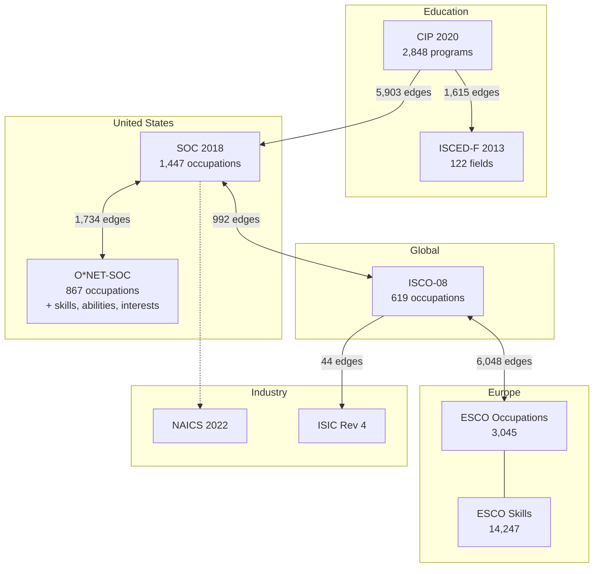
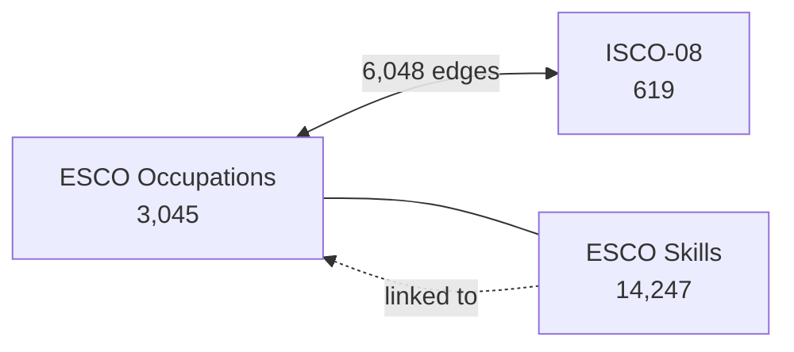
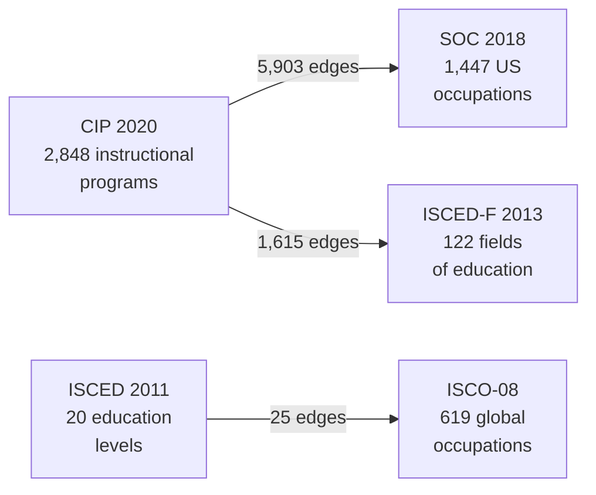

## Occupation Classification Systems Compared

> **TL;DR:** SOC for US labor data, ISCO for global comparison, ESCO for European skills matching, O*NET for detailed occupation attributes. Connected by 10,000+ crosswalk edges with education-to-career pathways through CIP.

---

## System overview

| System | Codes | Region | Purpose | Authority |
|--------|-------|--------|---------|-----------|
| ISCO-08 | 619 | Global (ILO) | International occupation standard | International Labour Organization |
| SOC 2018 | 1,447 | United States | US federal occupation classification | Bureau of Labor Statistics |
| O*NET-SOC | 867 | United States | Detailed occupation database with skills | Department of Labor |
| ESCO Occupations | 3,045 | Europe (EU) | European occupation taxonomy | European Commission |
| ESCO Skills | 14,247 | Europe (EU) | Skills and competences taxonomy | European Commission |
| ANZSCO 2022 | 1,590 | Australia/NZ | AU/NZ occupation standard | ABS/Stats NZ |
| NOC 2021 | 51 | Canada | Canadian occupation classification | Statistics Canada |
| UK SOC 2020 | 43 | United Kingdom | UK occupation standard | ONS |
| KldB 2010 | 54 | Germany | German occupation classification | Federal Employment Agency |
| ROME v4 | 93 | France | French job/occupation repertoire | Pole emploi |

## How occupation systems connect



## SOC vs ISCO: The two major frameworks

### SOC 2018 (Standard Occupational Classification)

- **1,447 detailed occupations** across 6 levels
- **Structure**: 2-digit major groups (23) down to 6-digit detailed occupations
- **Used for**: US government statistics, labor market data, visa classifications (H-1B), wage surveys
- **Updated**: approximately every 10 years

### ISCO-08 (International Standard Classification of Occupations)

- **619 occupations** across 4 levels
- **Structure**: 1-digit major groups (10) down to 4-digit unit groups
- **Used for**: International labor statistics, ILO reporting, basis for national systems
- **Key difference**: Broader categories than SOC; designed for international comparison

### Crosswalk between SOC and ISCO

SOC 2018 and ISCO-08 are connected by **992 crosswalk edges**. The mapping is many-to-many because SOC is more granular than ISCO.

```bash
# Translate a SOC code to ISCO
curl https://worldoftaxonomy.com/api/v1/systems/soc_2018/nodes/29-1211/equivalences
```

## ESCO - European skills and occupations

ESCO is the EU's multilingual classification connecting occupations to skills:

- **3,045 occupations** mapped to ISCO-08 (6,048 crosswalk edges)
- **14,247 skills and competences** linked to occupations
- **Key advantage**: Skills-based matching across EU labor markets
- **Use cases**: Job portals, skills gap analysis, career guidance, Europass



> ESCO is the only system in the graph that connects occupations directly to skills. This makes it essential for AI-powered job matching and workforce analytics.

## O*NET - Occupation information network

O*NET extends SOC with rich attribute data:

- **867 occupations** mapped to SOC 2018 (1,734 crosswalk edges)
- **Includes**: Knowledge areas, abilities, work activities, work context, interests (RIASEC), work values, work styles
- **Key advantage**: Most detailed occupation attribute data available
- **Use cases**: Career exploration, job analysis, workforce development

| O*NET Component | Items | What It Measures |
|-----------------|-------|-----------------|
| Knowledge Areas | 14 | Subject domains required |
| Abilities | 17 | Cognitive, physical, sensory capabilities |
| Work Activities | 16 | General types of job behaviors |
| Work Context | 15 | Physical and social work environment |
| Interests (RIASEC) | 13 | Holland occupational interest types |
| Work Values | 14 | What workers find important |
| Work Styles | 17 | Personal characteristics for performance |

## Education-to-occupation pathways

The crosswalk topology connects education to occupations:



This lets you answer questions like "What occupations do graduates of CIP 51.0912 (Physician Assistant) work in?"

```bash
curl https://worldoftaxonomy.com/api/v1/systems/cip_2020/nodes/51.0912/equivalences
```

## Occupation-to-industry mapping

Occupations connect to industries through two paths:

| Link | Edges | Use Case |
|------|-------|----------|
| SOC 2018 to NAICS 2022 | 55 | US workforce-to-industry analysis |
| ISCO-08 to ISIC Rev 4 | 44 | Global occupation-industry mapping |

## Which system to use

| Purpose | Recommended System | Why |
|---------|-------------------|-----|
| US labor statistics | SOC 2018 | Required by BLS/Census |
| International comparison | ISCO-08 | ILO standard |
| European job matching | ESCO | EU multilingual, skills-linked |
| Career exploration | O*NET-SOC | Rich attribute data |
| Australian/NZ workforce | ANZSCO 2022 | National standard |
| Canadian workforce | NOC 2021 | National standard |
| Skills gap analysis | ESCO Skills | 14K skills taxonomy |
| Education-to-career mapping | CIP 2020 + SOC | 5,903 crosswalk edges |

## Use cases

| Who | What | Systems |
|-----|------|---------|
| HR analytics teams | Map job postings to standard codes | SOC 2018, ISCO-08 |
| Career counselors | Match education to occupations | CIP 2020, SOC 2018, O*NET |
| EU job portals | Skills-based matching across borders | ESCO Occupations + Skills |
| Immigration lawyers | Classify occupations for visa applications | SOC 2018 (H-1B) |
| Workforce planners | Identify skills gaps by region | ESCO Skills, O*NET |
| AI recruitment agents | Automate classification via MCP | All of the above |

## MCP tools for occupation data

| Tool | Purpose |
|------|---------|
| `search_classifications` | Find occupations by job title |
| `get_equivalences` | Cross-system occupation mapping |
| `translate_code` | Translate between SOC, ISCO, ESCO |
| `browse_children` | Navigate occupation hierarchy |
| `get_country_taxonomy_profile` | What occupation systems apply to a country |
